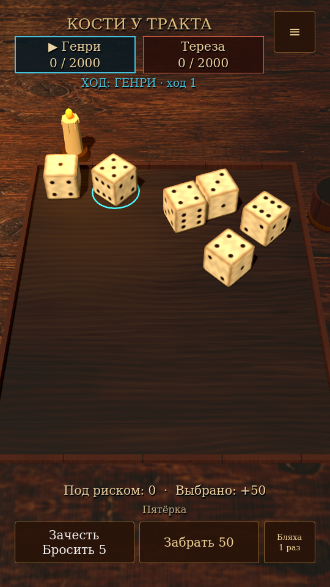

# Кости у тракта

[](https://github.com/Petasus69/kcd2-dice/actions/workflows/android.yml)

Офлайн-игра для Android на **Godot 4.6.3**, вдохновлённая костями из
Kingdom Come: Deliverance II. Деревянный стол, свеча, физические броски костей
и русский интерфейс для игры против ИИ или вдвоём на одном телефоне.

Основная разработка идёт в **`main`**, проект движка — **`godot/project.godot`**.
Текущая версия — **0.3.1**, игра находится в разработке.



## Возможности

- Физический бросок обычных костей: результат определяется верхней гранью после остановки.
- Выбор комбинаций касанием, зачёт, переброс оставшихся костей и полный повторный бросок.
- Раздельный счёт игроков, указание активного хода, очки под риском и подтверждение передачи телефона.
- Четыре ИИ с разной склонностью к риску, восемь столов, тренировка и ставки в игровых грошах.
- Бляхи: перебросы, дополнительные кости, воскрешение, превращение, множители,
  защита, фора и особые очковые комбинации; коллекция и объяснение эффектов.
- Сохранение и продолжение партии, журнал, настройки звука, вибрации и скорости решений ИИ.
- Портретная и альбомная ориентация, работа без аккаунтов, рекламы и подключения к сети.

**Особые кости и бляха Шута пока не перенесены.** Все игроки и ИИ используют
обычные кости. Вероятности особых граней и согласование результата с анимацией
будут проработаны отдельно. Численные эффекты некоторых блях ещё требуют сверки
с оригинальной игрой; проект не заявляет полное совпадение с KCD2.

## Установить на Android

1. Откройте [сборки Godot Android](https://github.com/Petasus69/kcd2-dice/actions/workflows/android.yml).
2. Выберите последнюю успешную сборку ветки `main`.
3. Скачайте артефакт **`Kosti-u-trakta-apk`**, распакуйте ZIP и установите **`Kosti-u-trakta.apk`**.

Для скачивания артефактов GitHub может потребовать вход. APK предназначен для
Android 7.0+ с ARM32/ARM64; установка файлов вне магазина должна быть разрешена
в настройках устройства.

Это development-сборка. Без настроенного постоянного ключа подпись меняется
между сборками: перед установкой потребуется удалить прежнюю Godot-версию,
что удалит её локальные сохранения. Настройка постоянной подписи описана в
[инструкции разработчика](docs/DEVELOPMENT.md#подпись-apk).
Пакет приложения сохранён совместимым с Godot-прототипом; архивная веб-версия
использует другой пакет и может оставаться установленной.

## Запустить проект

Установите **Godot 4.6.3 Standard** и импортируйте `godot/project.godot`
через менеджер проектов. Нажмите **F5** для запуска. Версия .NET не требуется.
В терминале из корня репозитория:

```bash
godot --editor --path godot
```

Игра использует рендерер **Compatibility**. Node.js нужен только для генерации
эталонных тестовых данных, в приложение он не входит.

## Структура репозитория

| Каталог / файл | Назначение |
| --- | --- |
| [`godot/`](godot/) | Основной проект: сцена стола, физика, правила, ИИ, меню и сохранения |
| [`godot/tests/`](godot/tests/) | Проверки правил, бросков, механик, касаний и мобильного интерфейса |
| [`docs/DEVELOPMENT.md`](docs/DEVELOPMENT.md) | Запуск тестов, архитектура, сборка и подпись APK |
| [`CONTRIBUTING.md`](CONTRIBUTING.md) | Порядок дальнейшей разработки |
| [`CHANGELOG.md`](CHANGELOG.md) | История версий |
| [`legacy/`](legacy/) | Архив веб-версии 0.1.0 и эталонный JS-движок для сверки правил |
| [`.github/workflows/android.yml`](.github/workflows/android.yml) | Проверки и сборка Godot APK для `main` и pull request |

Дальнейшие игровые изменения вносятся в `godot/`. Веб-версия сохранена для
истории и проверок; её APK больше не собирается автоматически.

## Проверки и дальнейшая работа

Автоматические проверки сверяют **34 419 вариантов подсчёта** и **753 перехода
состояния** с прежним движком, затем проверяют физику, бляхи, сохранения, ИИ
и касания на четырёх размерах экрана. Команды — в
[инструкции разработчика](docs/DEVELOPMENT.md#проверки).

Следующие направления: визуал и освещение, ощущения от броска и выбора на
реальных телефонах, оптимизация Android, особые кости и дальнейшая сверка правил.
Тесты на настольном компьютере не заменяют проверку производительности и ввода
на Android-устройстве.

## Авторство и лицензии

Проект не связан с Warhorse Studios. Kingdom Come: Deliverance принадлежит
правообладателям оригинальной игры. Модели, текстуры костей, доска и звук
созданы для проекта; оригинальные игровые ресурсы не извлекались.
Фон таверны создан ImageGen и используется как источник текстуры дерева.

Код — [MIT](LICENSE). DejaVu Serif — [лицензия шрифта](godot/assets/FONT-LICENSE.txt).
Сведения о сторонних ресурсах архивной веб-версии находятся в `legacy/`.
